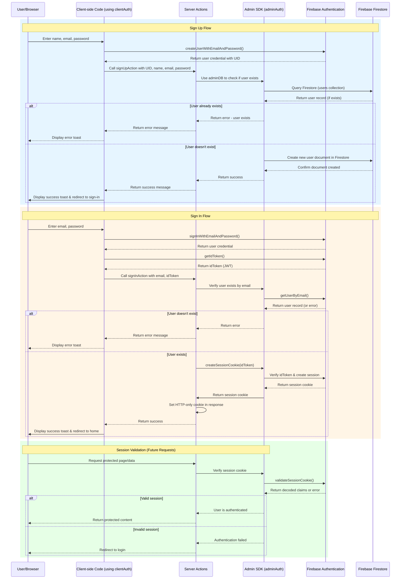

# VoxNavi – Navigate your future, one answer at a time

This is a [Next.js](https://nextjs.org) project bootstrapped with [`create-next-app`](https://nextjs.org/docs/app/api-reference/cli/create-next-app).

## Getting Started

First, run the development server:

```bash
npm run dev
# or
yarn dev
# or
pnpm dev
# or
bun dev
```

Open [http://localhost:3000](http://localhost:3000) with your browser to see the result.

You can start editing the page by modifying `app/page.tsx`. The page auto-updates as you edit the file.

This project uses [`next/font`](https://nextjs.org/docs/app/building-your-application/optimizing/fonts) to automatically optimize and load [Geist](https://vercel.com/font), a new font family for Vercel.

## Learn More

To learn more about Next.js, take a look at the following resources:

- [Next.js Documentation](https://nextjs.org/docs) - learn about Next.js features and API.
- [Learn Next.js](https://nextjs.org/learn) - an interactive Next.js tutorial.

You can check out [the Next.js GitHub repository](https://github.com/vercel/next.js) - your feedback and contributions are welcome!

## Deploy on Vercel

The easiest way to deploy your Next.js app is to use the [Vercel Platform](https://vercel.com/new?utm_medium=default-template&filter=next.js&utm_source=create-next-app&utm_campaign=create-next-app-readme) from the creators of Next.js.

Check out our [Next.js deployment documentation](https://nextjs.org/docs/app/building-your-application/deploying) for more details.

## UserAuth using Firebase




## Detailed Auth Explanations

### Sign Up Process:

1. User enters their information in the AuthForm component
2. Client-side Firebase creates the auth record via `createUserWithEmailAndPassword`
3. You get a user credential with a UID from Firebase Authentication
4. The server action `signUpAction` then stores additional user information in Firestore
5. If successful, user is redirected to sign in

### Sign In Process:

1. User enters email/password in the AuthForm
2. Client-side Firebase authenticates via `signInWithEmailAndPassword`
3. You request an ID token (JWT) from the authenticated user
4. The server action `signInAction` verifies the user and creates a session cookie
5. This cookie is set in the HTTP response as an HTTP-only cookie
6. Future requests will include this cookie automatically, authenticating the user

### What is the ID Token (`idToken`)?

The ID token is a JWT (JSON Web Token) that:

- Is created by Firebase when a user authenticates
- Contains the user's identity information
- Is cryptographically signed to verify authenticity
- Is short-lived (usually 1 hour)
- Gets exchanged on the server for a longer-lived session cookie
